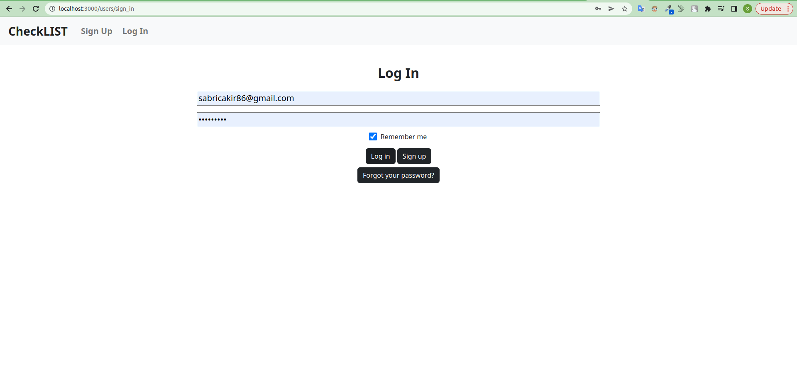

# Checklist APP with Rails 7

### Bu projemde Rails 7 ile Checklist Uygulaması Gerçekleştirdim.
➡ Bu Web Uygulamasında user authentication sistemi mevcut (yeni bir kullanıcı olarak kayıt olup ya da var olan bir kullanıcı ile giriş yapabiliyorsunuz)
bkz. [devise-gem](https://rubygems.org/gems/devise)  
➡ Ekstra olarak dinamik bir web sayfası oluşturmak için **Turbo Frame'leri** de kullandım. 
➡ Öncelikle ana sayfada eğer giriş yapmadıysanız, giriş yapmanız için bir uyarı sayfası karşılıyor sizleri. 
➡ Eğer giriş yaptıysanız, kendinize özel oluşturmuş olduğunuz yapılacaklar listesi sizi karşılar. 
➡ Giriş yapmak için ana sayfada karşınıza çıkan uyarı sayfasından ya da yukarıda bulunan sign up/log in kısmını kullanabilirsiniz. 
➡ Giriş yaptıktan sonra yeni bir yapılacaklar listesi oluşturmak için **Add New Item** butonunu kullanabilirsiniz. 
➡ Var olan bir işi yanında bulunan butonlar sayesinde dilerseniz tamamlandı olarak işaretleyebilir dilerseniz de listeden silebilirsiniz. 
➡ Tüm listeyi temizlemek için listenin en üstünde bulunan **Delete All Items** butonunu kulllanabilirsiniz. 
➡ Son olarak bu Web Uygulamasının stil düzenlemesini ise [bootstrap 5](https://getbootstrap.com/) kullanarak gerçekleştirdim. 
 
 
 
  
  
  
   
   
  
  
  
   
   
  
  
